<div align="center">
  

  <h3>Self-hosted game servers dashboard for friend groups</h3>

  
  
  
</div>

---

## 🔥 What is Cobalt?

Cobalt is a web dashboard for running game servers on your own VPS. Set up a server in just a few clicks. It's a fraction of the cost compared to specialized hosting platforms. You stay in full control of your data, your configs, and your uptime.

No subscriptions. No third-party control. Just your server, your rules.

🖼️ Dashboard screenshots:
<details>
<summary>Click me</summary>

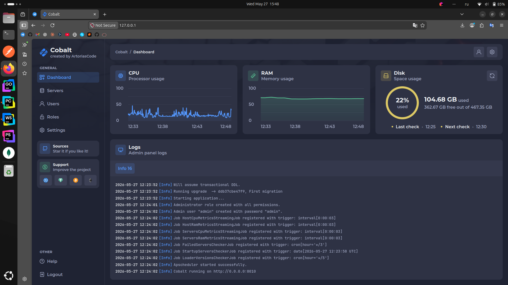
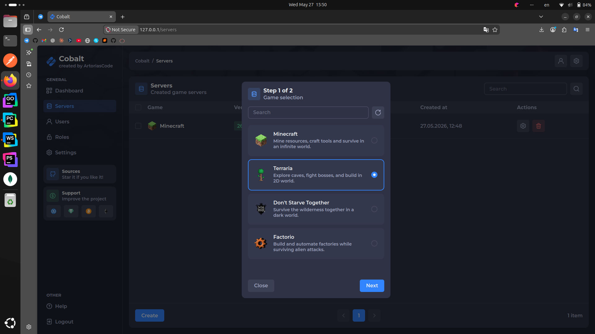

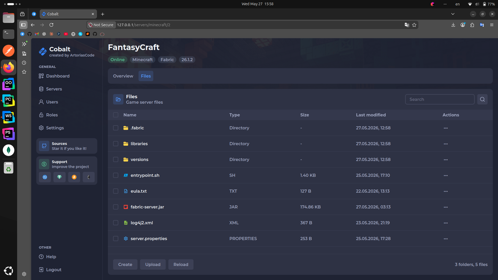


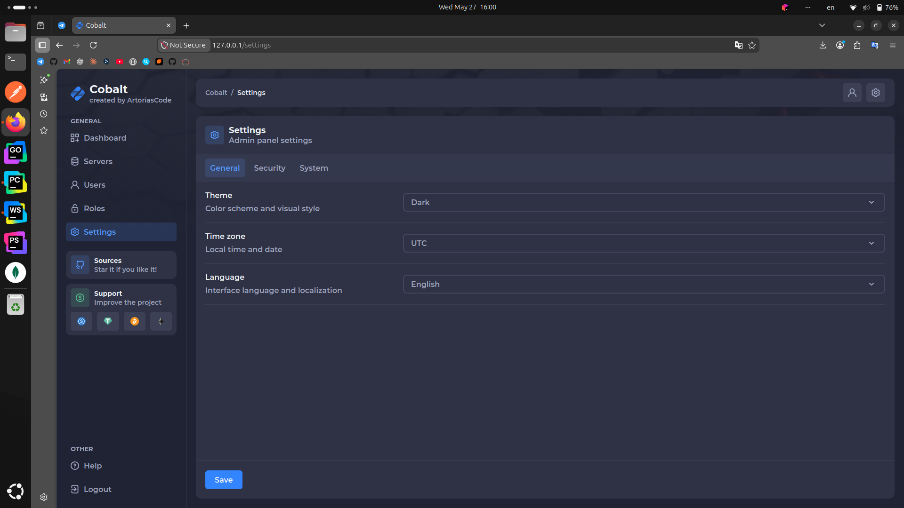

</details>

## 🎮 Supported Games

> [!NOTE]
> This list will be expanded in the future

|                                             Icon                                              | Game | Loaders |
|:---------------------------------------------------------------------------------------------:|------|---------|
|      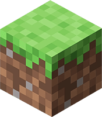       | Minecraft | Forge, Fabric |
|       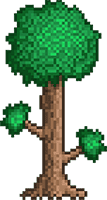       | Terraria | Vanilla, tModLoader |
| 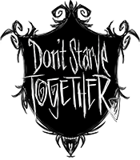 | Don't Starve Together | Vanilla |
|              | Factorio | Vanilla |

## ⚙️ Features

- Start, stop and restart servers in one click
- Run commands via built-in console
- Manage configs and upload files right from the browser
- Monitor CPU and RAM usage in real time
- Create users with roles and control what each one can access
- Manage multiple servers from one place

## 🚀 Getting Started

1) Open CMD / Terminal.

2) Connect to the server via SSH:

```bash
ssh root@<server_ip>
```

> [!TIP]
> If this is your first attempt, you will be prompted to enter "yes"

3) Enter the server password.

> [!TIP]
> The letters won't appear as you type, but that's normal

4) Clone the repository:

```bash
git clone https://github.com/ArtoriasCode/cobalt
```

5) Navigate to the project directory:

```bash
cd cobalt
```

6) Make the installer executable:

```bash
chmod +x build/scripts/install.sh
```

7) Run the installer:

```bash
./build/scripts/install.sh --prod --vps <server_ip>
```

The installer will automatically install Docker and Docker Compose if not present, generate SSL certificates and all `.env` files, build and start the containers.

However, since the certificates are self-signed, you'll see a warning the first time you open the dashboard. You'll need to click the `Advanced` button, and at the bottom you'll see a button labeled `Proceed to <server_ip> (unsafe)`.

> [!TIP]
> Your dashboard will be accessible at `https://<server_ip>`

## 🧪 Testing

1. Navigate to the tests directory:

```bash
cd tests
```

2. Install dependencies:

```bash
npm install
```

3. Create your `.env` file from the example:

```bash
cp .env.example .env
```

4. Run all E2E tests:

```bash
npm run test:e2e
```

> [!IMPORTANT]
> Make sure the dashboard and all required containers are running before executing tests

## ❓ FAQ

<details>
<summary>How can I suggest an idea or a game?</summary>

You can create an [issue](https://github.com/ArtoriasCode/cobalt/issues/new/choose) using a special template and submit your idea or a new game there.

</details>

<details>
<summary>Where can I get a VPS?</summary>

Any VPS provider works. Just make sure it runs Ubuntu 22+.

</details>

<details>
<summary>Can I access the dashboard from my phone?</summary>

Yes, the dashboard is adapted for all devices.

</details>

<details>
<summary>What does the dashboard look like?</summary>


</details>

<details>
<summary>How can I support the project financially?</summary>

|                                  Icon                                   | Token | Network | Address |
|:-----------------------------------------------------------------------:|-------|---------|---------|
| 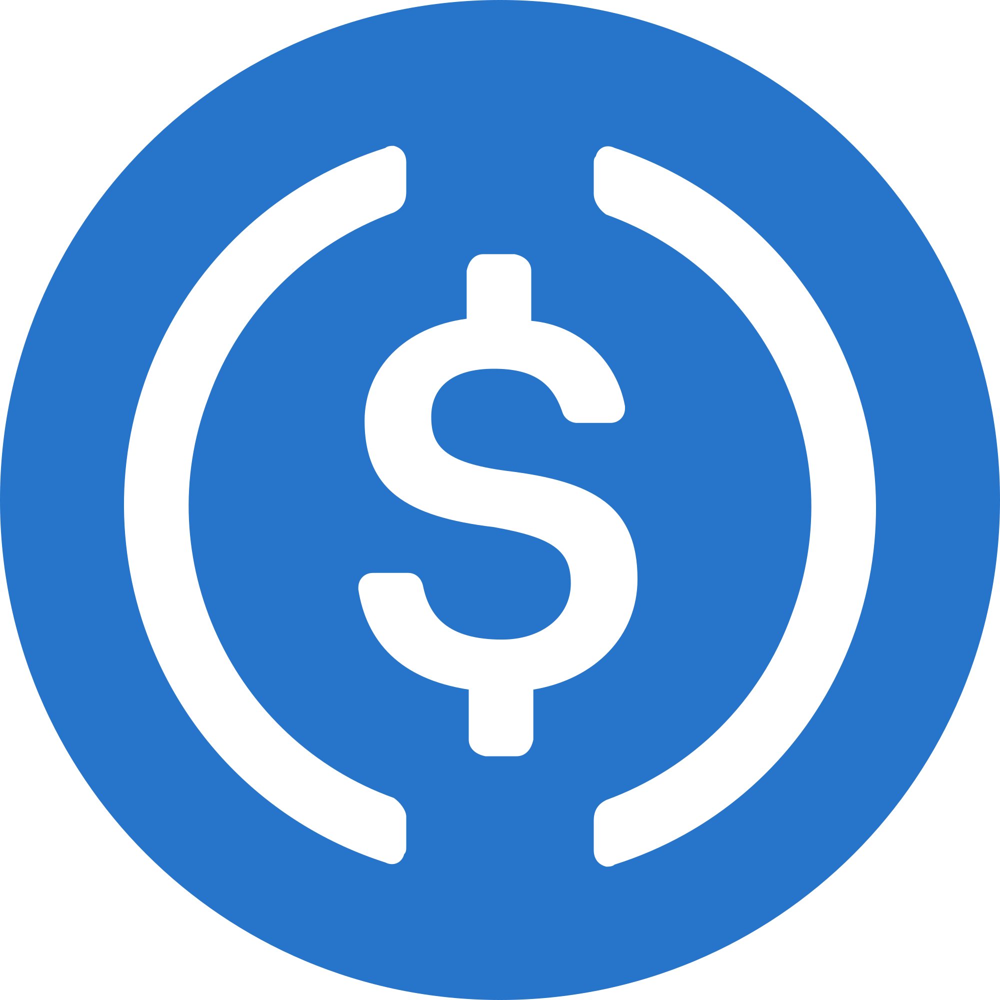  | USDC | ERC20 / BEP20 | `0x0C24ee1cDC35824390879Bd8A7235c473FCEcEDC` |
|   | USDC | SPL | `7gUG9Xz94V7nBEdC37DD5fhH75L6qQxRmnpke19tQVZP` |
| 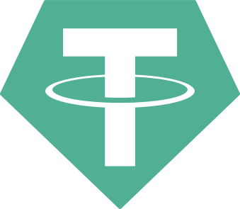  | USDT | ERC20 / BEP20 | `0x0C24ee1cDC35824390879Bd8A7235c473FCEcEDC` |
|   | USDT | SPL | `7gUG9Xz94V7nBEdC37DD5fhH75L6qQxRmnpke19tQVZP` |
|   | USDT | TRC20 | `TK85QzUhftZmm3rfDreWnVi5Q5eE5t42e1` |
|    | BTC | Bitcoin | `bc1qnw605zwkz6jz23fsydxmzms7tsh7jwp2kaumjw` |
|  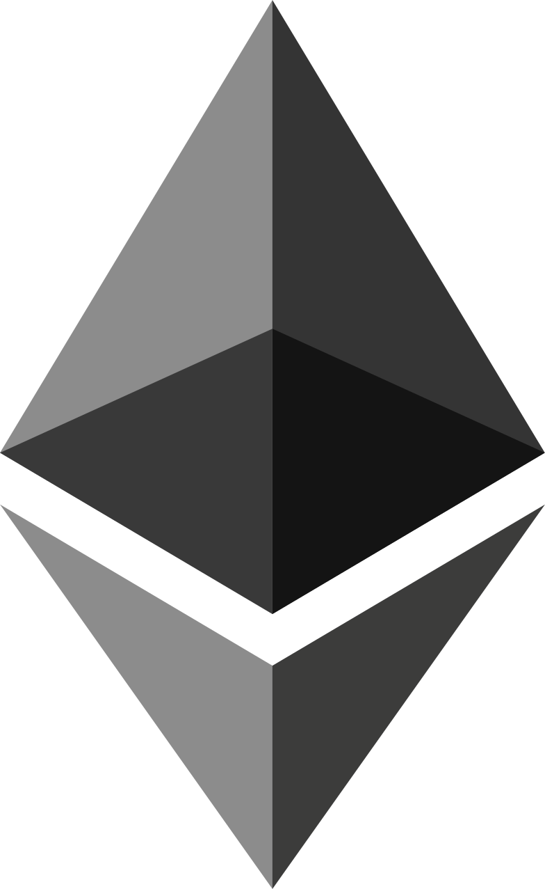  | ETH | Ethereum | `0x0C24ee1cDC35824390879Bd8A7235c473FCEcEDC` |
|  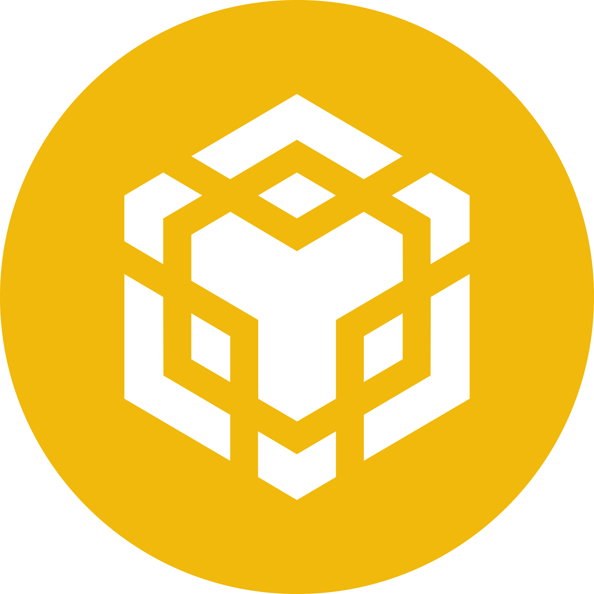  | BNB | BNB Smart Chain | `0x0C24ee1cDC35824390879Bd8A7235c473FCEcEDC` |
|  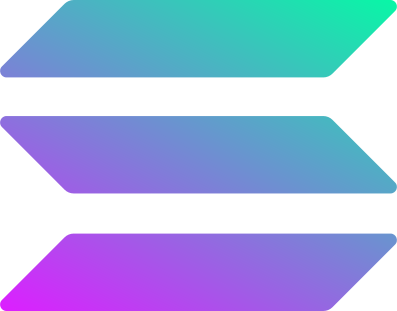  | SOL | Solana | `7gUG9Xz94V7nBEdC37DD5fhH75L6qQxRmnpke19tQVZP` |

</details>