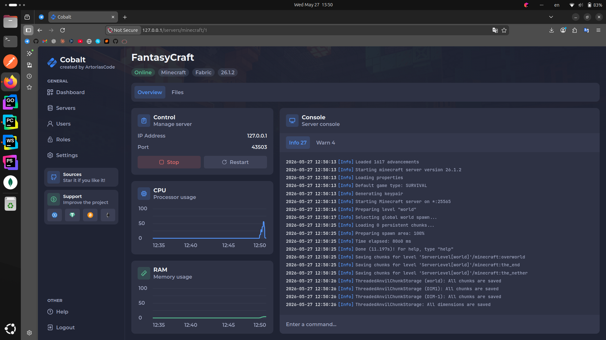
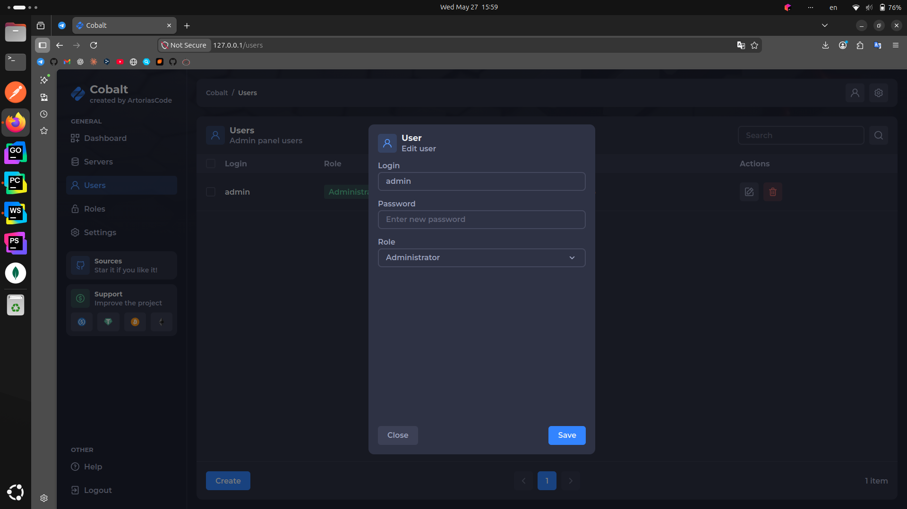
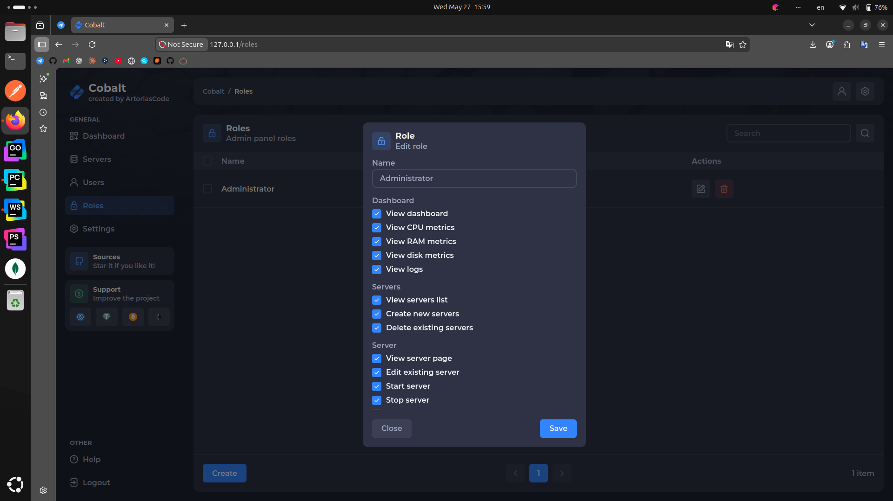
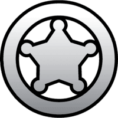
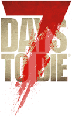

  

  <h3>Self-hosted game servers dashboard for friend groups</h3>

  
  
  
  

---

## What is Cobalt?

Cobalt is a web dashboard for running game servers on your own VPS / VDS. It cuts out the middleman - no overpriced hosting plans, no vendor lock-in, no handing your data over to third parties. One machine, multiple games, your rules.

<ins>Dashboard screenshots</ins>

## Getting started

Whether you're setting up Cobalt for the first time or looking to contribute, the links below cover everything you need - from installation guides to community discussions where you can share ideas and vote on new game support.

- [Documentation](https://artoriascode.github.io/cobalt/) - installation, testing and more.
- [Issues](https://github.com/ArtoriasCode/cobalt/issues) - report bugs and problems.
- [Ideas](https://github.com/ArtoriasCode/cobalt/discussions/categories/ideas) - share your ideas and suggest new games.
- [Help](https://github.com/ArtoriasCode/cobalt/discussions/categories/help) - ask your questions.

> [!WARNING]
> Before posting anything, please read the guidelines.

## Supported games

Cobalt supports the creation of servers for a wide variety of games and their loaders. Each server runs in its own isolated Docker container. This ensures the independence of the servers and their files.

The following games are currently supported:

|                                              Icon                                              | Game                  | Loaders              |
|:----------------------------------------------------------------------------------------------:|-----------------------|----------------------|
|              | Minecraft             | Paper, Forge, Fabric |
|               | Terraria              | Vanilla, tModLoader  |
|   | Don't Starve Together | Vanilla              |
|               | Factorio              | Vanilla              |
|              | RimWorld              | Together             |
|      | 7 Days to Die         | Vanilla              |

## Features

Cobalt ships with everything you need to run and manage game servers without leaving the browser:
- Easy server management and sending game commands.
- Real-time / last 15 minutes monitoring of CPU and RAM usage for your VPS / VDS and each game server.
- Creating multiple users and roles with the ability to control access to virtually every section of the dashboard.
- A convenient file manager and editor for managing files and editing configuration files.
- Automatic fetching of the latest available game versions.
- Multilingual support (English, Russian, Ukrainian).
- Full mobile devices support.

## FAQ

Where can I get a VPS / VDS?

Any VPS / VDS provider works. Just make sure it runs Ubuntu 22+.

What does the dashboard look like?

How can I support the project financially?

|                                  Icon                                   | Token | Network | Address |
|:-----------------------------------------------------------------------:|-------|---------|---------|
|   | USDC | ERC20 / BEP20 | `0x0C24ee1cDC35824390879Bd8A7235c473FCEcEDC` |
|   | USDC | SPL | `7gUG9Xz94V7nBEdC37DD5fhH75L6qQxRmnpke19tQVZP` |
|   | USDT | ERC20 / BEP20 | `0x0C24ee1cDC35824390879Bd8A7235c473FCEcEDC` |
|   | USDT | SPL | `7gUG9Xz94V7nBEdC37DD5fhH75L6qQxRmnpke19tQVZP` |
|   | USDT | TRC20 | `TK85QzUhftZmm3rfDreWnVi5Q5eE5t42e1` |
|    | BTC | Bitcoin | `bc1qnw605zwkz6jz23fsydxmzms7tsh7jwp2kaumjw` |
|    | ETH | Ethereum | `0x0C24ee1cDC35824390879Bd8A7235c473FCEcEDC` |
|    | BNB | BNB Smart Chain | `0x0C24ee1cDC35824390879Bd8A7235c473FCEcEDC` |
|    | SOL | Solana | `7gUG9Xz94V7nBEdC37DD5fhH75L6qQxRmnpke19tQVZP` |

